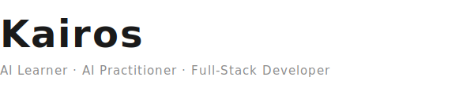

## Tech Stack

## Current Focus

**AI Agent** — Exploring autonomous agent architectures and intelligent systems

## Contact

[kenpete@163.com](mailto:kenpete@163.com) · [GitHub](https://github.com/Kairos0922)
