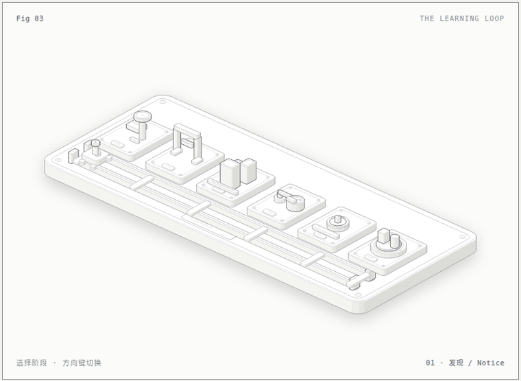

<picture>
  <source media="(prefers-color-scheme: dark)" srcset="assets/kairos-lab-dark.jpg">
  <source media="(prefers-color-scheme: light)" srcset="assets/kairos-lab-light.jpg">
  
</picture>

  <a href="#selected-work">Selected work</a> &nbsp; / &nbsp;
  <a href="#a-learning-method">Learning method</a> &nbsp; / &nbsp;
  <a href="#toolbox">Toolbox</a> &nbsp; / &nbsp;
  <a href="mailto:kenpete@163.com">Say hello</a>

### Ideas into systems. Systems into understanding.

I’m **Kairos**, an independent builder exploring AI agents and intelligent systems. I build tools that make agents useful beyond the chat window, and visual experiments that make complex ideas easier to understand.

> 在合适的时刻，把复杂系统做成可理解、可参与的工具。

## Selected work

### 01 / Agents, within reach

**[dsh-wechat-bridge](https://github.com/Kairos0922/dsh-wechat-bridge)**

Turn WeChat into a mobile control surface for DeepSeek Harness through Tencent’s official iLink. This TypeScript bridge routes across modes, keeps people in approval loops, manages rate-aware queues, and exposes web settings for practical remote operation.

TypeScript &nbsp; / &nbsp; Agent routing &nbsp; / &nbsp; Human approvals &nbsp; / &nbsp; WeChat

### 02 / Knowledge, made visible

**[knowledge-video-studio](https://github.com/Kairos0922/knowledge-video-studio)**

An evidence-minded pipeline for animated science explainers: research, scripting, voiceover, rendering, and QC move through explicit human-approval points. Built in JavaScript, it uses browser DOM, SVG, and GSAP to turn checked claims into watchable visual narratives.

JavaScript &nbsp; / &nbsp; Browser rendering &nbsp; / &nbsp; Fact checking &nbsp; / &nbsp; Human checkpoints

## A learning method

### 03 / The learning loop

**As models make answers easier to retrieve, learning is knowing what to ask next.**

An interactive method for turning an unfamiliar situation into a useful question: notice, frame, model, test, revise, and transfer. A paper-plane puzzle makes the thinking concrete; the goal is not to memorize its answer, but to practise a process that carries into the next unknown.

> 让天下没有难学的知识：不囤积结论，练习发现、定义、检验、修正，再把方法带到新的问题。

**[Explore the learning loop →](https://kairos0922.github.io/Kairos0922/learning-loop-light.html)** &nbsp; · &nbsp; [Dark version](https://kairos0922.github.io/Kairos0922/learning-loop.html) &nbsp; · &nbsp; [How it was made](https://github.com/Kairos0922/Kairos0922/tree/main/docs/src/learning-loop)

Learning method and copy by Kairos. Interactive figure crafted with the open-source [Anatomy](https://github.com/wheresryan22/anatomy) skill.

## How I build

**Keep people in control.** Consequential actions deserve visible approval boundaries.

**Show the working.** A good explanation starts with traceable sources and checked claims.

**Make it inspectable.** Let people explore the system, not just read a promise about it.

## Toolbox

`TypeScript` &nbsp; `JavaScript` &nbsp; `Node.js` &nbsp; `Python` &nbsp; `Vue` &nbsp; `Angular` &nbsp; `Git`

---

  <b>Build. Learn. Share.</b> 
  A small lab for useful agents and understandable systems.  
  <a href="mailto:kenpete@163.com">kenpete@163.com</a> &nbsp; / &nbsp;
  <a href="https://github.com/Kairos0922?tab=repositories">Browse the repositories</a>

